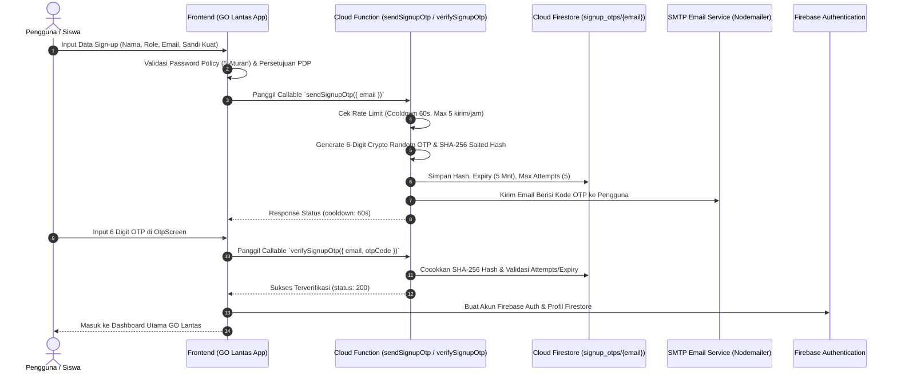

# Panduan Implementasi Auth SIGAP / GO Lantas Korlantas POLRI
## Firebase Auth, Cloud Functions OTP, Password Policy & Kepatuhan UU PDP

Aplikasi **GO Lantas (SIGAP Korlantas POLRI)** mengimplementasikan sistem autentikasi bertingkat militer dengan standar **OWASP**, **Firebase Auth & App Check**, **Cloud Functions OTP (Crypto SHA-256)**, **Rate Limiting**, serta kepatuhan penuh terhadap **UU No. 27 Tahun 2022 tentang Pelindungan Data Pribadi (PDP)**.

---

## 🏛️ Arsitektur Keamanan Autentikasi



---

## 🔒 Fitur Keamanan Utama

1. **OTP Crypto-Random & SHA-256 Salt Hashing**:
   - Kode 6 digit dihasilkan menggunakan `crypto.randomInt(100000, 999999)`.
   - Kode **tidak pernah** disimpan dalam bentuk teks polos di database Firestore.
   - Kode di-hash menggunakan `SHA-256` dengan salt rahasia sebelum disimpan di dokumen `signup_otps/{email}`.

2. **Rate Limiting & Anti-Spam / Anti-Brute Force**:
   - **Cooldown Kirim Ulang**: 60 detik jeda sebelum pengguna dapat meminta kirim ulang kode.
   - **Batas Kirim Per Jam**: Maksimal 5 kali pengiriman OTP per jam per alamat email.
   - **Batas Percobaan OTP**: Maksimal 5 kali salah input kode sebelum kode dianggap hangus (invalidated).
   - **Masa Berlaku OTP**: Kedaluwarsa otomatis setelah 5 menit.
   - **Lockout Proteksi Brute-Force Login**: 5 kali kegagalan login berturut-turut memicu penguncian akun selama 5 menit.

3. **Kebijakan Kata Sandi Ketat (OWASP 5-Criteria)**:
   - Minimal 8 karakter.
   - Mengandung huruf besar (*uppercase* `A-Z`).
   - Mengandung huruf kecil (*lowercase* `a-z`).
   - Mengandung angka (`0-9`).
   - Mengandung karakter khusus/simbol (`!@#$%^&*` dsb).
   - Indikator kekuatan kata sandi dinamis (*Weak*, *Medium*, *Strong*).

4. **Kepatuhan UU No. 27 Tahun 2022 (Pelindungan Data Pribadi / PDP)**:
   - Kotak persetujuan (*Consent Checkbox*) eksplisit terhadap Syarat Layanan & Kebijakan Privasi.
   - Peringatan khusus pendampingan orang tua/wali untuk pengguna di bawah umur (<17 tahun / peran pelajar).

5. **Mode Demo Cerdas (Smart Failover)**:
   - Jika Firebase Functions atau koneksi internet belum dikonfigurasi / belum upgrade ke Blaze Plan, aplikasi otomatis mengaktifkan **Simulator OTP Cerdas** dengan banner demo yang memudahkan penguji mencoba alur tanpa hambatan.

---

## 🚀 3 Langkah Deploy Cloud Functions & Mengaktifkan Email Asli

### Langkah 1: Setup Proyek Firebase & Upgrade ke Blaze Plan
1. Buka [Firebase Console](https://console.firebase.google.com/).
2. Buat proyek baru atau pilih proyek yang sudah ada.
3. Masuk ke menu **Build > Functions** dan upgrade proyek ke **Blaze (Pay as you go)** (diperlukan Firebase untuk izin akses outbound networking SMTP).
4. Aktifkan **Authentication (Email/Password & Google)** dan **Firestore Database**.

### Langkah 2: Konfigurasi Kredensial SMTP & Environment Variables
Salin template konfigurasi di dalam folder `functions/`:
```bash
cd functions
cp .env.example .env
```
Isi parameter di `.env`:
```ini
SMTP_HOST=smtp.gmail.com
SMTP_PORT=587
SMTP_USER=korlantas.sigap.official@gmail.com
SMTP_PASS=your-app-password-or-smtp-key
SMTP_FROM="GO Lantas Korlantas POLRI" <no-reply@korlantas.polri.go.id>
OTP_SALT=korlantas_sigap_ultra_secret_salt_2026
```
*(Catatan: Anda dapat menggunakan Gmail App Password, Resend, SendGrid, SMTP2GO, atau Mailgun).*

### Langkah 3: Deploy Cloud Functions ke Firebase
Pastikan Firebase CLI telah terpasang:
```bash
npm install -g firebase-tools
firebase login
firebase use --add [PROJECT_ID_ANDA]
```
Jalankan build dan deploy:
```bash
cd functions
npm install
npm run build
firebase deploy --only functions
```

Functions yang akan aktif di region `asia-southeast2` (Jakarta):
- `sendSignupOtp`: Mengirimkan OTP 6-digit dengan rate limit & salt hash.
- `verifySignupOtp`: Memvalidasi kode OTP, masa berlaku, dan batas percobaan.
- `reverifyOtp`: Mengirim ulang OTP untuk akun yang belum sempat terverifikasi.

---

## 💻 Menghubungkan Frontend ke Firebase
Di root folder `demo-lantas/`, salin `.env.example` menjadi `.env.local`:
```bash
VITE_FIREBASE_API_KEY=AIzaSy...
VITE_FIREBASE_AUTH_DOMAIN=project-id.firebaseapp.com
VITE_FIREBASE_PROJECT_ID=project-id
VITE_FIREBASE_STORAGE_BUCKET=project-id.appspot.com
VITE_FIREBASE_MESSAGING_SENDER_ID=123456789012
VITE_FIREBASE_APP_ID=1:123456789012:web:...
VITE_FIREBASE_REGION=asia-southeast2
```

Setelah file `.env.local` disimpan, jalankan aplikasi:
```bash
npm run dev
```
Sistem akan otomatis mendeteksi koneksi Firebase dan Cloud Functions secara langsung.
